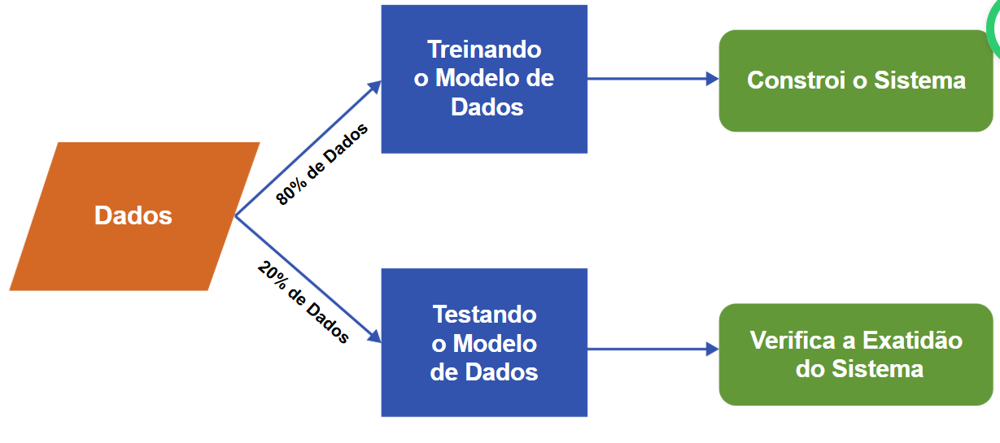

## Análise de Experiência

### Tipos de Gráficos
#### Gráficos de linhas
Gráficos de linhas são um dos tipos mais comumente utilizados para comparar dois conjuntos de dados. Utilize gráficos de linhas quando o número de pontos de dados for elevado e quando você desejar mostrar uma tendência nos dados ao longo do tempo. 
Casos de uso para gráficos de linhas:
As vendas trimestrais de uma empresa nos últimos cinco anos. 
O número de clientes por semana no primeiro ano de uma nova loja de varejo.
Mudanças no preço de uma ação desde a abertura até o fechamento. 
Práticas recomendadas para gráficos de linhas:
Rotule os eixos e as linhas de referência usadas para medir as coordenadas do gráfico. É comum traçar o tempo no eixo x (horizontal) e os valores de dados no eixo y (vertical).  
Use uma linhas contínua para conectar os pontos de dados para ilustrar as tendências. 
Mantenha mínimo o número de linhas plotadas, normalmente não mais de 5, para que o gráfico não fique confuso e difícil de ler.
Adicione uma legenda, uma pequena representação visual dos dados do gráfico, que informa o que cada linhas representa para ajudar o público a entender o que está visualizando. 
Sempre adicione um título.  

#### Gráficos da Coluna
Os gráficos de colunas são posicionados verticalmente, conforme mostrado na figura. Provavelmente, são o tipo de gráfico mais comumente usado para exibir o valor numérico de um ponto de dados específico e comparar esse valor entre categorias semelhantes. Eles permitem a fácil comparação entre vários pontos de dados.  
Casos de uso para gráficos de colunas:
Receita por país, conforme mostrado no exemplo de gráfico. 
Vendas do ano passado para as quatro principais empresas automobilísticas nos Estados Unidos. 
Pontuações médias dos testes dos alunos para cada uma das seis aulas de matemática. 
Práticas recomendadas para gráficos de colunas:
Rotule os eixos. 
Se o gráfico mostrar alterações ao longo do tempo, trace os incrementos de tempo no eixo x. 
Se o tempo não fizer parte dos dados, considere ordenar as alturas das colunas em ordem crescente ou decrescente para demonstrar mudanças ou tendências.  
Mantenha o número de colunas baixo, normalmente não mais de 7, para que o visualizador possa ver o valor de cada coluna.  
Inicie o valor do eixo y em zero para refletir com precisão o valor total da coluna. 
O espaçamento entre as colunas deve ser aproximadamente metade da largura de uma coluna. 

#### Gráficos de barras
Os gráficos de barras são semelhantes aos gráficos de colunas, exceto que os dados são exibidos horizontalmente. Os gráficos de barras também permitem uma comparação fácil entre vários pontos de dados. Os rótulos dos pontos de dados no gráfico de barras horizontais estão no lado esquerdo e são mais legíveis quando o rótulo contém texto em vez de valores. 
Casos de uso para gráficos de barras:
Produto interno bruto (PIB) das 25 nações com maior faturamento. 
O número de carros em uma concessionária vendidos por cada representante de vendas.
As pontuações na prova para cada aluno em uma turma de matemática. 
Melhores práticas para gráficos de barras:
Rotule os eixos. 
Considere ordenar as barras de modo que os comprimentos vão do maior para o menor. O tipo de dados provavelmente determinará se a barra mais longa deve estar na parte inferior ou superior para melhor ilustrar o padrão ou tendência pretendida.
Inicie o valor do eixo x em zero para refletir com precisão o valor total das barras.
O espaçamento entre as barras deve ser aproximadamente metade da largura de uma barra. 

#### Gráficos de Pizza
Os gráficos de pizza mostram partes de um todo. Cada fatia, ou segmento, da “torta” representa uma porcentagem do número total. A soma total dos segmentos deve ser igual a 100%. Um gráfico de pizza exibe os diferentes valores de uma determinada variável. Alguns casos de uso que ilustram a comparação das informações com um gráfico de pizza incluem:
Categorias de despesas anuais para uma empresa (por exemplo, aluguel, administrativo, serviços públicos, produção)
As fontes de energia de um país (por exemplo, petróleo, carvão, gás, solar, eólica)
Resultados de pesquisa para tipo de filme favorito (por exemplo, ação, romance, comédia, drama, ficção científica)
Algumas práticas recomendadas para gráficos de pizza incluem:
Mantenha o número de categorias mínimo para que o espectador possa diferenciar entre os segmentos. Depois de dez segmentos, as fatias começam a perder significado e impacto. Se necessário, consolide segmentos menores em um segmento com um rótulo como "Outros" ou "Diversos". 
Utilize uma cor diferente ou tons de escala de cinza para cada segmento. 
Ordene os segmentos de acordo com o tamanho. 
Certifique-se de que o valor de todos os segmentos somados seja igual a 100%. 

#### Gráficos de dispersão
Os gráficos de dispersão são muito populares para visualizações de correlação ou quando você deseja mostrar a distribuição, ou todos os valores possíveis, de um grande número de pontos de dados. Os gráficos de dispersão também são úteis para demonstrar o agrupamento ou identificar valores discrepantes nos dados. Alguns casos de uso que ilustram a visualização da distribuição de muitos pontos de dados com um gráfico de dispersão incluem:
Comparação das expectativas de vida dos países com seus PIBs (Produto Interno Bruto).
Comparação das vendas diárias de sorvete com a temperatura externa média em vários dias.
Comparação do peso com a altura de cada pessoa em um grupo grande. 
Algumas práticas recomendadas para gráficos de dispersão incluem:
Rotular os eixos. 
Certifique-se de que o conjunto de dados seja grande o suficiente para fornecer visualização de agrupamentos ou valores atípicos. 
Inicie o valor do eixo y em zero para representar os dados com precisão. O valor do eixo x dependerá dos dados. Por exemplo, as faixas etárias podem ser rotuladas no eixo x. 
Considere adicionar uma linhas de tendência se um gráfico de dispersão mostrar uma correlação entre os eixos x e y.
Não use mais de duas linhas de tendência. 

## Compreendendo Big Data
- Termo usado para descrever grandes volumes de dados digitais gerados, coletados e processados. Dados que se movem rapidamento, são apenas muito grandes ou muito complexos. Ex: dados gerados por contas de mídia social, dados de e-commerce.
- Suas características mudam a forma como os dados são coletados, transmitidos, armazenados e acessados.

### 4Vs do Big Data e seus Desafios
- Escala de dados (volume): descreve a quantidade de dados transportados e armazenados, de acordo com o IDC, descobrir maneiras de processar as quantidades crescentes de dados gerados a cada dia é um desafio.
- Formato de dados (variedade): forma que os dados podem assumir, a maioria provém de dados não estruturados, como vídeos, imagens. Sendo assim, são complexos para as arquiteturas tradicionais de armazenamento de data warehouse.
- Análise de fluxo de dados (velocidade): taxa a qual os dados são gerados. Desse modo, a infraestrutura de dados deve responder instantaneamente às demandas das aplicações que acessam e transmitem os dados.
- Incerteza de dados (veracidade): impedir que dados imprecisos estraguem os conjuntos de dados, o aumento da veracidade na coleta de dados pode reduzir a quantidade de limpeza de dados necessária.

### Impulsionadores de crescimento de dados
1. Proliferação de dispositivos da Internet das Coisas (IoT)
2. Maior acesso à internet, maior acesso à banda larga
3. Uso de smartphones 
4. Popularidade das redes sociais

### Gestão de Big Data

#### Pipelines de Dados
- Gerenciamento de dados - o processo inclui: desenvolvimento de infraestrutura e sistemas para ingerir os dados, limpá-los, transformá-los e por fim armazená-los de forma a facilitar o acesso e a consulta dos dados para o restante das pessoas na empresa para responder perguntas comerciais.
- O que é um pipeline? 
    - Ingestão, Transformação e Armazenamento ou ETL (Extract, Transform and Load)
    - Processamento: duas fontes principais de dados, lotes de servidores ou bancos de dados (ingestão de lote) e eventos em tempo real e streaming do mundo dos dispositivos (ingestão de streaming)
    - Transformação: dados precisam ser limpos, ou seja, remover valores nulos, datas no formato correto e dados desatualizados rapidamente. A estrutura deve se alinhar com o sistema necessário para manter análises precisas
    - Armazenamento: precisam ser armazenados em locais e formulários, facilitando a execução de relatórios sobre vendas semanais e para os cientistas de dados para criar modelos de recomendação preditivos. Além da segurança e gerenciamento de acesso a dados. O armazenamento pode ser local ou em nuvem ou híbridos.

## Inteligência Artificial e Aprendizagem de Máquina
#### Tipos de Análise de Aprendizado de Máquina
1. Supervisionado: são os mais usados para análise preditiva, requer interação humana para rotular os dados lidos para um aprendizado aupervisionado preciso. O modelo é ensinado por meio de exemplos usando conjuntos de dados de entrada e saída, processados por especialistas. Coleta as informações e as utiliza para gerar previsões com base em novos conjuntos de dados. Geralmente resolve problemas de regressão e classificação.
    - Regressão: Estimativa das relações matemáticas entre uma variável contínua e uma ou mais outras variáveis. Ex. Estimar a posição e velocidade de um carro usando GPS.
    - Classificação: Variável conhecida discreta, normalmente envolve estimar qual amostra específica pertence a um conjunto de classes predefinidas. Ex. filtrar email em spam ou não spam. 
2. Sem supervisão: não exisgem especialistas humanos, mas descobrem padrões de forma autônoma. Lida principalmente com daddos não rotulados, exemplos são clustering e associação.
    - Clustering: agrupamento de dados que têm características semelhantes, ajundando a segmentar em grupos e analisar cada um para encontrar padrões. Ex. grupos de usuários com base no histórico de compras online
    - Associação: descobri grupos de itens geralmente observados juntos. Ex. varejistas online para sugerir compras adicionais a um usuário com base no conteúdo do carrinho.
3. Reforço: ensina por tentativa e erro, usando o feedback de suas experiências, também conhecido como aprendizado com erros. Envolve em atribuir valores positivos para valores desejados e o inverso. Ex. construção de IA para jogar videogames

#### O Processo de Aprendizado de Máquina
O desenvolvimento de uma solução de aprendizado de máquina raramente é um processo linear. Várias etapas de tentativa e erro são necessárias para ajustar a solução. Os detalhes de cada etapa realizada pelos cientistas de dados dos Data Crunchers, enquanto trabalham no novo modelo de identificação e erradicação de ervas daninhas, são os seguintes:

- Etapa 1. Preparação de dados – Execute procedimentos de limpeza de dados, como transformação em um formato estruturado e remoção de dados ausentes e observações com ruído/corrompidas.   
- Etapa 2.
    - Passo 2a. Dados de aprendizado - Criar um conjunto de dados de aprendizado usado para treinar o modelo. 
    - Passo 2b. Dados de teste – Crie um conjunto de dados de teste usado para avaliar o desempenho do modelo. Execute esta etapa apenas no caso de aprendizado supervisionado.   
- Etapa 3. Loop do processo de aprendizagem – Seleção. Um algoritmo é escolhido de acordo com o problema. Dependendo do algoritmo selecionado, podem ser necessárias etapas adicionais de pré-processamento.
- Etapa 4. Loop do processo de aprendizagem – Avaliação. O desempenho desse algoritmo selecionado é avaliado nos dados de aprendizado. Se o algoritmo e o modelo atingirem um desempenho aceitável nos dados de aprendizado, a solução validará os dados de teste. Caso contrário, repita o processo de aprendizado com um novo modelo e algoritmo propostos.
- Etapa 5. Avaliação do modelo – Teste a solução nos dados de teste. Os desempenhos nos dados de aprendizagem não são necessariamente transferíveis para os dados de teste. Quanto mais complexo e ajustado for o modelo, maiores serão as chances de ele se tornar propenso a overfitting, o que significa que ele não pode ter um desempenho preciso em relação a dados não vistos. O ajuste excessivo pode resultar no retorno ao processo de aprendizado do modelo.   
- Etapa 6. Implementação do modelo – Depois que o modelo atingir um desempenho satisfatório nos dados de teste, implemente o modelo. Implementar o modelo significa realizar as tarefas necessárias para dimensionar a solução de aprendizado de máquina para Big Data.  

- O reconhecimento de padrões utiliza algoritmos de aprendizado de máquina para identificar padrões em dados digitais. Esses padrões são aplicados a diferentes conjuntos de dados com o objetivo de reconhecer padrões iguais ou semelhantes nos novos dados.
- O reconhecimento de padrões usa o conceito de aprendizado para classificar dados com base nas informações estatísticas obtidas com os padrões e suas representações. O aprendizado permite que os sistemas de reconhecimento de padrões sejam "treinados" e adaptáveis para fornecer resultados mais precisos. Ao treinar o sistema de reconhecimento de padrões, uma parte do conjunto de dados prepara o sistema, e o restante testa a precisão do sistema. Conforme mostrado na figura abaixo, o conjunto de dados é dividido em dois grupos: treinar o modelo e testar o modelo. O conjunto de dados de treinamento é usado para criar o modelo e consiste em cerca de 80% dos dados. Ele contém o conjunto de imagens usadas para treinar o sistema. O conjunto de dados de teste consiste em cerca de 20% dos dados e mede a precisão do modelo. Por exemplo, se o sistema que identifica categorias de aves puder identificar corretamente sete em cada dez aves, a precisão do sistema será de 70%.

- Os algoritmos de reconhecimento de padrão podem ser aplicados a diferentes tipos de dados digitais, incluindo imagens, textos ou vídeos, e podem ser usados para automatizar e resolver totalmente problemas analíticos complicados. As aplicações e os casos de uso para reconhecimento de padrões são praticamente ilimitados. Alguns exemplos incluem:
    1. Segurança móvel – Identificação de impressões digitais ou reconhecimento facial para obter acesso a um smartphone.  
    2. Engenharia – Reconhecimento de fala por sistemas de assistente digital, como Alexa, Google Assistant e Siri.  
    3. Geologia – Detecção de tipos específicos de rochas e minerais e interpretação de padrões temporais em gravações de matrizes sísmicas.  
    4. Biomédica – Uso de padrões biométricos para identificar células tumorais e cancerígenas no corpo.